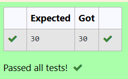

# Ex1D Evaluation of prefix expression
## DATE: 26/02/2025
## AIM:
To write a C function to evaluate the given prefix expression using stack and print the output of the given prefix expression from the stack inside the function . 

## Algorithm
1. Start the program.
2. Include the required libraries.
3. Define the functions to handle pop and push operations of the stack.
4. Construct a function to evaluate the prefix expression using stack and print the output.
5. End the program.  

## Program:
```
/*
Program to evaluate the given prefix expression
Developed by: VIJEY K S 
RegisterNumber: 212223040239  
*/

#include<stdio.h>
#include<string.h>
#include<ctype.h>

int s[50];
int top=0;

void push(int ch)
{
	top++;
	s[top]=ch;
}

int pop()
{
	int ch;
	ch=s[top];
	top=top-1;
	return(ch);
}

void evalprefix(char prefix[50])
{
    	int a,b,c,i;
    	for(i=strlen(prefix)-1;i>=0;i--)
	{
		if(prefix[i]=='+')
		{
			c=pop()+pop();
			push(c);
		}
		else if(prefix[i]=='-')
		{
			a=pop();
			b=pop();
			c=a-b;
			push(c);
		}
		else if(prefix[i]=='*')
		{	
		a=pop();
		b=pop();
		c=b*a;
		push(c);
		}
		else if(prefix[i]=='/')
		{
			a=pop();
			b=pop();
			c=a/b;
			push(c);
		}
		else
		{
			push(prefix[i]-48);
		}
	}
	printf("%d",pop());
    
}

int  main()
{
	char prefix[50]="*+69-31";
	evalprefix(prefix);
	return 0;
}


	

```

## Output:


## Result:
Thus, the C program to evaluate the prefix expression using stack and print the output of the given prefix expression from the stack inside the function is implemented successfully.
